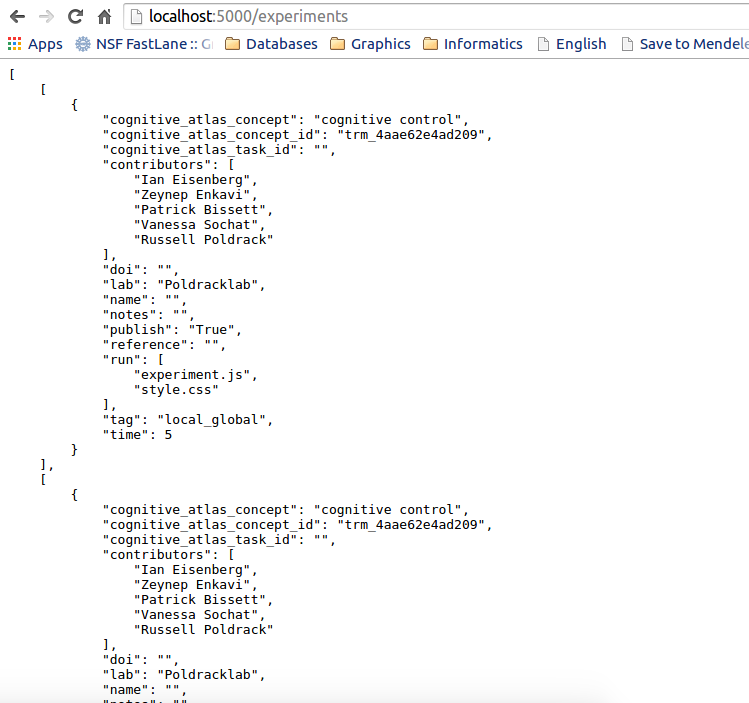
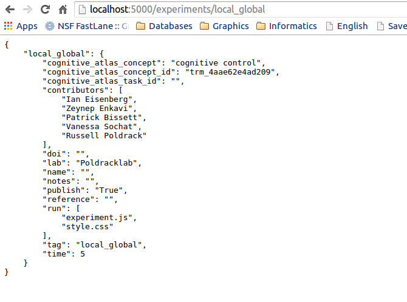

Application Program Interface (API)
===================================

About the API
-------------

The experiment factory executable is useful for making new batteries and experiments, but it can also work to serve a `RESTful API <https://en.wikipedia.org/wiki/Representational_state_transfer>`_. This basically means you can type in URLs in your browser, and it will spit data back at you. The data is in the JavaScript Object Notation (JSON) format, which is super easy to read into your software of choice (python, R, matlab, etc.). If you want to download static versions of the experiment data, we also `provide those <https://github.com/expfactory/expfactory.github.io/tree/master/data>`_ in our Github repo. We recommend, however, that you use the API because it will always download and return the most up-to-date experiments.

Running the API
---------------

After installation, start up the application.

::

     expfactory

Retrieving all Experiments
''''''''''''''''''''''''''

::

    http://localhost:8088/experiments

Retrieving a specific Experiment
''''''''''''''''''''''''''''''''

The unique id of an experiment is its "exp_id," which also corresponds to the name of its folder and the "exp_id" variable in its config.json. You can select an experiment by this unique id:

::

    http://localhost:8088/experiments/simple_rt

More API functions will come as requested. If there is a functionality you would desire, please `tell us <https://github.com/expfactory/expfactory-python/issues>`_.
