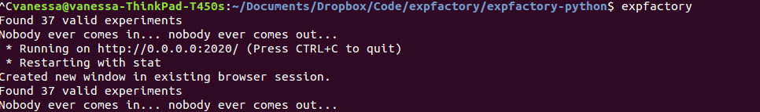
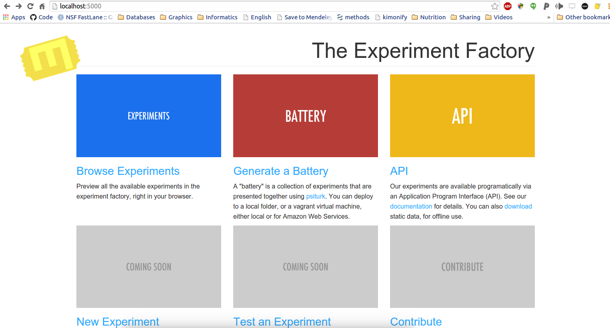
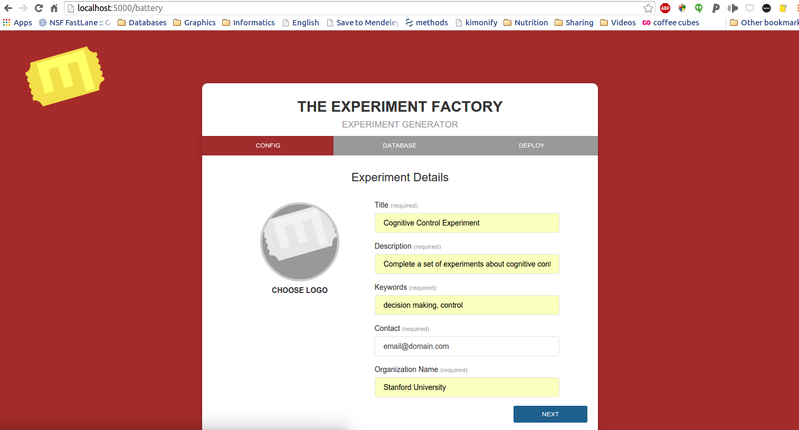
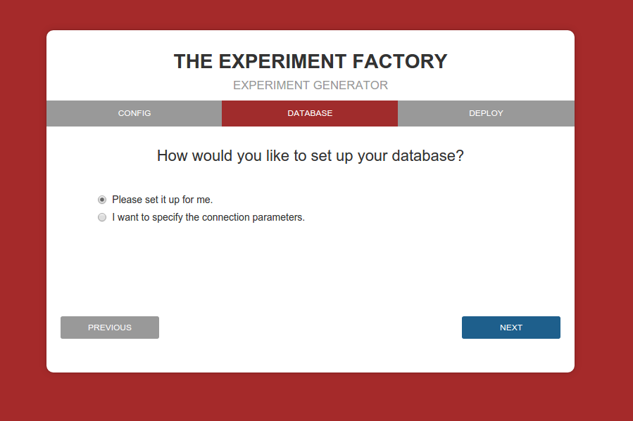
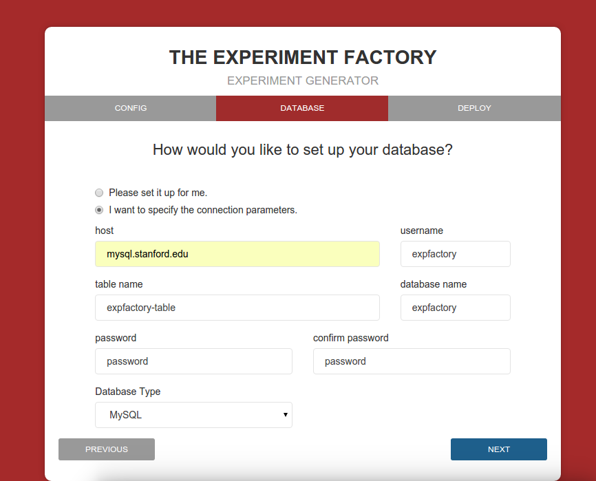
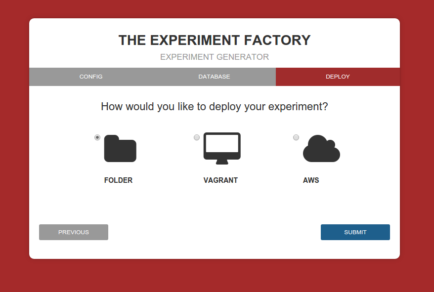
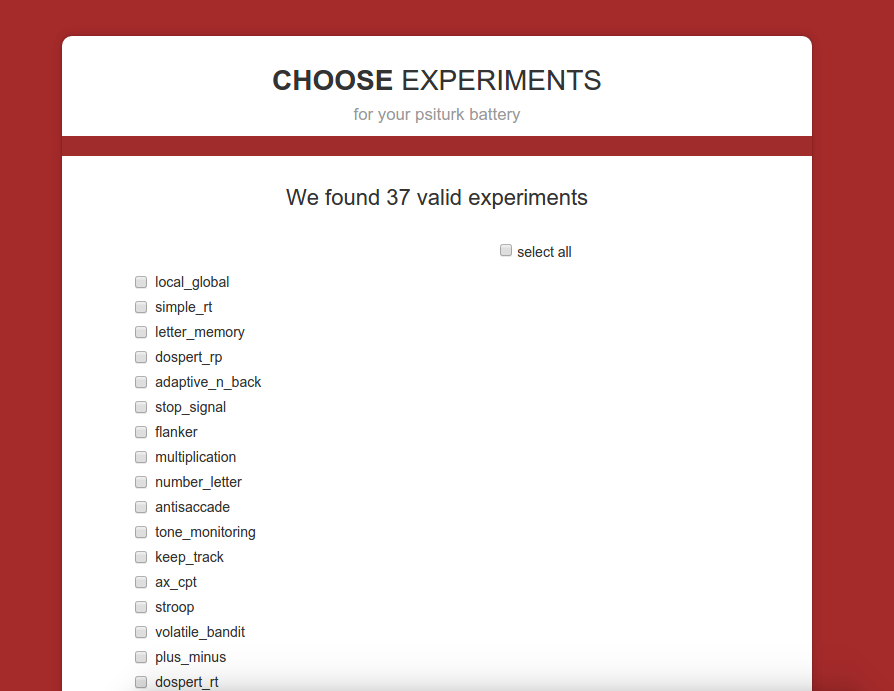
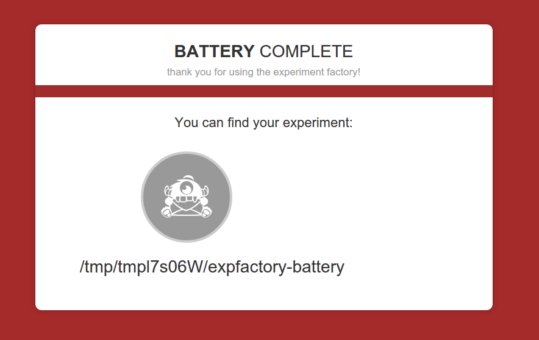

Deployments
===========

You should proceed with this steps after after `installation <http://expfactory.readthedocs.org/en/latest/installation.html>`_ of the Experiment Factory command line tool.

Local Battery
-------------

You can deploy a battery of experiments (meaning one or more experiments presented in a row) simply by using the expfactory command line tool. The basic function to generate a battery is the following:

:: 

       expfactory --run --experiments local_global_shape,test_task

The command "--run" will tell the application that you want to run a local battery. The "experiments" variable is required, and should be a comma separated list of experiment unique ids (exp_id), meaning folder names in the experiment repo. If the experiment id is not found it will not trigger an error, but the experiment will not be added to your battery.  You can also specify a subject id that will be embedded in the output data, and give a name for the data file (please don't use spaces):

::

       expfactory --run --experiments local_global_shape,test_task --subid id_123

You can also specify a maximum running time (in minutes), in the case that you want to randomly select from experiments up to some time:

::

       expfactory --run --experiments local_global_shape,test_task --time 30

The default is a very large number that (we hope) a battery would never go over. Finally, it could be the case that you want to use modified experiments, and in this case you can provide a folder of experiments as an argument:

::

       expfactory --run --experiments local_global_shape,test_task --folder /path/to/your/expfactory-experiments

or a battery folder as an argument:

::

       expfactory --run --experiments local_global_shape,test_task --battery /path/to/your/expfactory-battery

WARNING: Not specifying either the battery or experiments folder will always pull the latest from the repos. If you intend to run many subjects over time and want ensured consistency in the experiments, we reccommend that you clone both the battery and experiments repos, and specify them in the command:

::

       git clone https://github.com/expfactory/expfactory-experiments
       git clone https://github.com/expfactory/expfactory-battery
       expfactory --run --experiments local_global_shape,test_task --battery expfactory-battery  --folder expfactory-experiments

Psiturk
-------

The Experiment Factory Application Portal
.........................................

To run the executable to open up a web interface to design your psiturk experiment:

::

      expfactory

This will open up your browser to the experiment factory portal. From here you can click on `battery` to start design of your psiturk experiment battery. You can also use this tool to serve a `RESTful API of current experiments <http://expfactory.readthedocs.org/en/latest/api.html>`_.

Configure a psiturk battery of experiments
''''''''''''''''''''''''''''''''''''''''''

The web interface will take you through the following steps:

* A. collection of experiment details
* B. database connection parameters
* C. selection of local (folder) experiment, or deployment to AWS.
* D. selection of experiments

A. Collection of experiment details
...................................

A psiturk battery is controlled via a config.txt file, in which you specify details of your experiment. Here we will collect those fields:

All fields are required. Specifically:

* Title: should be the title of your experiment.
* Description: should describe what your experiment is measuring, or its goals.
* Keywords: should be lower-case, comma separated
* Contact: should be a valid email for psiturk to contact *only on error*
* Organization Name: is typically your institution or university

B. Database connection parameters
.................................

If you don't know anything about databases, you should let expfactory set up the database for you. In the case of a local folder, this will mean an sqlite3 file. In the case of a virtual machine or cloud (AWS) deployment, expfactory will configure a mysql database on the same server.

If you are testing, we recommend that you let expfactory set it up for you. For an actual deployment, and especially a cloud deployment, it is essential that you specify custom MySQL or Postgresql database parameters. Letting expfactory set up a cloud deployment means that the connection parameters are available for all to see, and this is a risk to your data and to the privacy of your participants. 

Finally, we do not allow for the option of an sqlite3 database beyond a local folder, because sqlite3 can only handle one read/write at a time, and thus is only appropriate for single-user, local testing. When setting up a database, example parameters are shown below:

Psiturkpy does not test these parameters for you.

C. Deployment
.............

You have several deployment options, including a local folder, a virtual machine (vagrant), or a cloud deployment (Amazon Web Services, or AWS).

How do I choose a deployment?
,,,,,,,,,,,,,,,,,,,,,,,,,,,,,

If you already have psiturk configured on your local machine and basically want to produce a folder to run, then you should choose the "Folder" option for deployment. If you do not specify database parameters, the default is to generate a sqlite3 file (a static database file in the same folder as your experiment).

If you want to use psiturk but don't want to install things on your local machine, a vagrant virtual machine would be appropriate. This means that you will ssh into the machine to "see" the folder with your experiment, and all required software and databases will be installed for you. The default IP address you will use to access the virtual machine in your browser is 192.128.0.20.

If you want a deployment that, for example, your lab could use to run many participants at once, you might want to set up psiturk on the cloud, for example, an Amazon Web Services EC2 Instance. If this is this case, we *strongly* recommend that you do not use the "default" database option, as it could compromise your data - you should enter the database parameters for a secure database that you create.

Before getting started, you should familiarize yourself with `psiturk <https://psiturk.org/quick_start/>`_. Likely you will be interested in setting up an experiment on your local machine, and so you should follow the installation instructions and go through the entire demo to make sure things are working properly.

Choosing "folder" will generate a local experiment, and either of the virtual machine options will produce a Vagrantfile that can be run to deploy the Virtual Machine. Specific instructions for a local vagrant or vagrant-aws are provided. Note that you can use the VagrantfileLocal or VagrantfileAWS file (renamed to Vagrantfile) as is from the `virtual machine <http://www.github.com/expfactory/expfactory-vm>`_ repo to generate a battery with all available, valid experiments.

D. Experiment selection
.......................

When you click "Next" on part C above, behind the scenes the battery and experiment folders are downloading, and the most updated set of experiments are run through a validator. In this experiment selection screen, you are presented with experiment folders from http://www.github.com/expfactory/expfactory-experiments repo that pass validation:

You can select as many or as few as you want, and they will be included in your custom battery. Note that in the future you will be able to select experiments based on task or concept from the `cognitive atlas <http://www.cognitiveatlas.org>`_.

After experiment selection, your battery generation is complete, and the web interface will tell you where you can find the folder or Vagrantfile:

In the case of a "folder" generation, you will see a standard psiturk experiment structure:

.. image:: _static/img/getting-started/6config.png

We recommend you move this folder to where you would like to keep it, and then cd to the folder, and type `psiturk` to start the experiment. Note that this assumes that you have properly installed psiturk on your machine. If not, please return to `these instructions <https://psiturk.org/quick_start/>`_.

In the case of a "vagrant" or "AWS" configuration, you will find a `Vagrantfile` in the output folder:

.. image:: _static/img/getting-started/5vagrantfile.png

Vagrant Deployment
''''''''''''''''''

One of the options is to produce a "Vagrantfile" for use on your local machine. This is ideal if you want to use psiturk locally, but don't want to go through installation of the module or a database. 

Setting up a local VM
.....................

 1. Install VirtualBox from https://www.virtualbox.org/wiki/Downloads
 2. Install Vagrant from http://www.vagrantup.com/downloads. Vagrant is a provisioning system that sets up the virtual machine.
 3. If you don't already have it, install git https://git-scm.com/downloads
 4.  You have two options to produce your Vagrantfile. If you want a custom battery, then you should run the executable expfactory, generate the file, and copy it to a folder outside of a the temporary directory. If you want to generate a vagrant machine with all valid tasks available, then you can clone the expfactory-vm repo and use the file "VagrantfileLocal" renamed to "Vagrantfile." Note that this is also the case for the AWS version (instructions below). 

::

    cd myvagrantdirectory
    git clone https://github.com/expfactory/expfactory-vm.git`
    cd expfactory-vm

We are now in a directory with the Vagrantfile. You can set up the virtual machine:

::

    vagrant up

Note that this can take some time. Keep the lookout for red statements that may indicate an error. If you find an error please report it as an `issue <https://github.com/expfactory/expfactory-vm/issues>`_.

.. image:: _static/img/vagrant/0vagrantup.png

The above shows a successful build.

 5. You can then log in with ssh

      vagrant ssh

  7. Your experiment is located in $HOME/expfactory-battery. The build files are in expfactory-build. Note that when you turn the server on and debug, you will need the -p option to make sure the machine does not attempt to open the link with a browser in the terminal.

::

    cd $HOME/expfactory-battery
    psiturk
    server on
    debug -p

Deployment to AWS
.................

You can equivalently produce a Vagrantfile with the expfactory module that can be deployed to AWS. Some expertise is assumed, namely that you are familiar with the EC2 section of the `AWS console <http://console.aws.amazon.com>`_. You will need to log in and create a security group, download a key, and fill in all variables required in the SCRIPT section of the Vagrantfile. 

 1. Make sure you have the most up-to-date version of vagrant from https://www.vagrantup.com/downloads, and install vagrant-aws. If you do not, you will see this error (version 1.6.5)

::

       vagrant-share can't be installed without vagrant login (RuntimeError)
 

And after updating:

::

      vagrant --version
      Vagrant 1.7.2

 2. Then you should install vagrant-aws, which will allow you to provision the Amazon machine.

::

      sudo vagrant plugin install vagrant-aws
      Installing the 'vagrant-aws' plugin. This can take a few minutes...
      Installed the plugin 'vagrant-aws (0.6.0)'!

You then need to add an aws compatible box. I found this box on the vagrant-aws plugin github repository:

      vagrant box add aws https://github.com/mitchellh/vagrant-aws/raw/master/dummy.box

 3. Fill in your Amazon credentials into the Vagrantfile, then bring up the machine

::

      vagrant up --provider=aws

A few important notes:

 * Make sure you mypem.pem file has the correct permissions:

::

   chmod 400 ~/.ssh/myfile.pem

 * Many times you will not be able to connect to your machine because the security group input/output is too stringent. Make sure to open ports to allow the default psiturk port to come through (22362) as well as SSH.

Expfactory-docker
-----------------

The Experiment Factory docker is a set of containers that can be run locally, or again on the cloud. The entire application comes packaged in a Docker image, meaning that installation and deployment of experiments happens in a web interface deployed by the image. We plan to offer experiment deployment as a service at `expfactory.org <http://www.expfactory.org>`_ and encourage you to `sign up <http://www.expfactory.org/signup>`_ to express interest. You can also `deploy our Docker infrastructure <http://www.expfactory.org/signup>`_ on your own server, however experience with docker and cloud computing is required.
