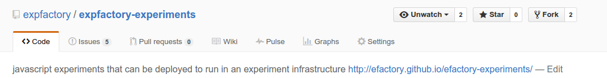
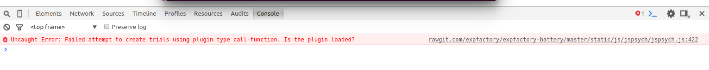
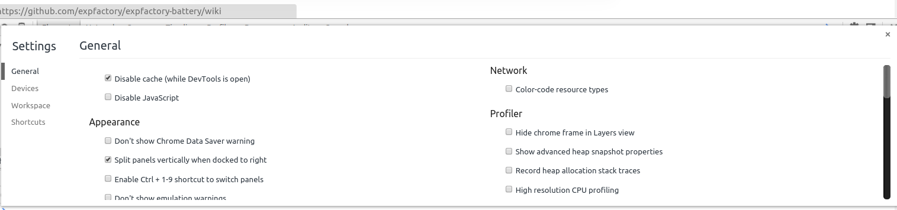

Development
===========

If you have not yet, please 'install `<http://vbmis.com/bmi/project/expfactory/installation.html>`_ the expfactory python application.

Contributing to code
--------------------

We recommend that you work with developing experiment code using Github. This means that your general workflow will be as follows:

* A. fork our experiments repo
* B. clone the repository to your local machine
* C. checkout a new branch for your update
* D. when you are happy, commit changes locally, then to your fork
* E. submit a pull request (PR) to our master branch to review the changes
* F. keep in sync with our master

This will also be the general workflow for making any contributions to the battery, virtual machines, or python application.

A. Fork our experiment repo
'''''''''''''''''''''''''''

When you browse to `our repo <https://github.com/expfactory/expfactory-experiments>`_, you will see a "Fork" button in the upper right:

Click it, and select your Github username to create a copy of the repository under your account name. 

A little about Github
.....................
You can think of Github as a home in the cloud to store your code, along with a history of all changes. This means that many people can collaboratively work on the same code and have a way to talk about changes, report issues, and merge it all together in the end. The way that Github works is based on having this "remote" version, along with a "local" version on your computer. The code base is generally called a "repository" (repo for short), and the way it is organized is based on branches. There is usually a default branch that is the "working" and "up to date" version of the code, and this is usually called "master." When you fork a repo, you should generally keep your version of "master" synced with the main (upstream) repository master. This is because we will use this branch as a template for all new branches. You can imagine if you are working on two features, you would want for each one to have a separate branch in your repo. If you use your master branch to work on the first feature, then you have no way of easily creating a fresh branch that is in sync with the upstream repo master that you forked. When someone talks about "getting code from" a repo, they usually will use the term "pull," and this is why when you make changes and ask another repo to accept (pull) your changes, it is called a "pull request." Sending code to the cloud repo will use the term "push." Rest assured that these terms and development practices will become second nature when you get into the groove of things. We will provide detailed instructions when possible, and please tell us if something is not clear.

B. Clone the repository to your local machine
'''''''''''''''''''''''''''''''''''''''''''''

After you fork the repo, you have created a version in the cloud associated with your account. But to work with it, you need to "clone" it to your local machine. You can do this by way of:

::

      git clone https://github.com/[your-username]/expfactory-experiments

Note that if you use ssh (instructions for setup are here) you should clone like this:

::

      git clone git@github.com:[your-username]/expfactory-experiments.git

where [your-username] is replaced with your Github account username.

A little about repos
....................

A repository is "connected" to Github via a simple config text file. If you look at this file, you can understand quickly how simple it is. For example, let's say we just cloned the experiments repo:

::

      cd expfactory-experiments

There is a hidden folder called ".git" with a config file in it. Generally you should not manually edit files in this folder, but the config is pretty easy to understand, and easy to edit to change the names of your repos or add other repos to push and pull to. Let's take a look at a standard config file:

::

      vim .git/config

:: 

      [core]
              repositoryformatversion = 0
              filemode = true
              bare = false
              logallrefupdates = true
      [remote "origin"]
              url = git@github.com:vsoch/expfactory-experiments.git
              fetch = +refs/heads/*:refs/remotes/origin/*
      [branch "master"]
              remote = origin
              merge = refs/heads/master

We want to make a quick change to this file. The rationale for this change is that many people might be working on expfactory experiments, and our version of "master" can quickly fall behind the expfactory master. With this in mind, we want to be able to easily "pull" from the expfactory master, which we will call "upstream." Here is my config file for the expfactory-python. Since I want to work with the "upstream" (main expfactory Organization repo) along with my version (associated with username vsoch) you will notice that I have added a few lines to specify an "upstream" remote:

:: 

      [core]
              repositoryformatversion = 0
              filemode = true
              bare = false
              logallrefupdates = true
      [remote "upstream"]
              url = git@github.com:expfactory/expfactory-experiments.git
              fetch = +refs/heads/*:refs/remotes/origin/*
      [remote "origin"]
              url = git@github.com:vsoch/expfactory-experiments.git
              fetch = +refs/heads/*:refs/remotes/origin/*
      [branch "master"]
              remote = origin
              merge = refs/heads/master

This means that, whenever I want to checkout my master to create a new branch from, or when either my PR or someone else's PR has been merged into the expfactory master, I should pull from upstream and push to my master:

::

      git pull upstream master

It will open a text file that is asking for you to commit a merge. Save this file to do so. Then push to your master:

::

      git push origin master

If you get errors about merge conflicts, this means that something was out of order, and you need to open up files that have conflicts to resolve the conflicts, and then commit. If you only use your master as a template to checkout new branches from, you should not run into this problem.
 
For the above example, you will also notice that the format of the URLs follows the SSH standard, because that is how I cloned it, and how it is setup on my computer. If you get errors about authentication, you likely have the wrong format specified in your config. A https url would look something like:

:: 

      [core]
              repositoryformatversion = 0
              filemode = true
              bare = false
              logallrefupdates = true
      [remote "origin"]
              url = https://github.com/vsoch/expfactory-experiments.git
              fetch = +refs/heads/*:refs/remotes/origin/*
      [branch "master"]
              remote = origin
              merge = refs/heads/master

It's pretty common to clone with HTTPS (copy pasting the url for a repo), and then edit the config to change to SSH to push and pull. You can define as many remotes as you like in this file so you can easily pull from your colleagues repos if you want to test what they are working on.

C. checkout a new branch for your update
''''''''''''''''''''''''''''''''''''''''''

You've now cloned the repository to your local machine, and you would want to check out a new branch to make an update. First, see what branch you are on:

::

      git branch
      * master
  

Then checkout a new branch, it's a good standard to give it a tag to describe what you are doing (fix/update/enh) and then a specific name. For example:

::

      git checkout -b update/add_my_experiment

You will then be switched to your new branch

::

      git branch
      master
      * update/add_my_experiment

Once the branch is created, it should be standard practice for you to first see what branch you are on before starting work for the day. If you need to switch, you don't need the "-b" argument:

::

      git checkout master
      git checkout update/add_my_experiment

D. commit changes
'''''''''''''''''

It's good practice to commit changes locally when you are happy, adding a message to provide details about what you've changed. You may first want to compare your recent work to what is on Github, and you can do this with:

::

      git status

It will show you changed, deleted, and added files. You can then "commit" these changes to your local repo, which basically means writing them into some local record in the .git folder to prepare for pushing to the remote repo:

::

      git commit -a

is read as "git commit all" and it will open up a text editor to show you a summary of the changes. It is expected with each commit that you describe what you have done in a message. You can either uncomment lines in the file (remove the "#") or write a message right at the top. Saving the file will commit the changes locally.

Finally, you can push to your local branch. The format is like:

::

     git push [remote] [branch]

where [remote] and [branch] correspond to the name of the remote and branch (in the .git/config) which means that for our example we might do:

::

      git push origin update/add_my_experiment

E. submit a pull request (PR) to our master branch
'''''''''''''''''''''''''''''''''''''''''''''''''''

Once you have made a change, and commit the change to your remote (cloud) repo, you would want to submit this change to us to consider merging into the expfactory master branch. It's easiest to do this with the online interface. You should go to your repo, and find the "Pull Request" button:

.. image:: _static/img/development/1pr.png

You will then want to select merging your base/branch into the expfactory/master branch. Please tell us in the comments what you have changed or added, and then submit the PR. We will be able to review your changes and give you feedback.

F. keep in sync with our master
'''''''''''''''''''''''''''''''

As we detailed above, remember that many people might be submitting PRs to work on the same code base, which means that your master branch can fall behind. Whether you are updating your master after your PR (or someone else's) was merged, this should be the first thing you do before checkout of a new branch:

::

      git checkout master
      git pull upstream master
      git push origin master
      git checkout -b enh/add_function

Now that you are a development Github pro, you might want more details about the format of a new experiment.

Contributing to experiments
---------------------------
An experiment is just a folder with files that are expected to be a certain way. The "core" of an experiment is:

* config.json: a file with a bunch of information about an experiment, meta-data
* experiment.js: a javascript file to run the experiment
* style.css: (optional) custom styling

A recommended strategy for developing a new experiment is to `find an experiment <https://github.com/expfactory/expfactory-experiments>`_ similar to the one you want to make, copy the folder, and edit it. We recommend using JsPsych for tutorials, help, and examples, as the `documentation <http://docs.jspsych.org/tutorials/go-nogo-task/>`_ is really great. We also provide an standard reaction time (commented) empty template `for you to download <https://github.com/expfactory/expfactory-python/raw/master/expfactory/templates/experiment_template.zip>`_, and in the future will provide a dynamic web interface for generating new templates.
 

Summary of Best Practices
'''''''''''''''''''''''''

* An experiment must minimally have an experiment.js and valid config.json file
* We use jspsych plugins for most experiments, and most are included with the battery repo, meaning you don't need to include them with your local folder, but rather specify their path in the "run" variable of your config.json (see below).
* the folder name must correspond with the "tag" variable in the config.json
* experiment folder names should be all lowercase, no hyphens (-), or spaces.
* you can include any images/sounds supplementary files in your experiment folder, it will be included
* these supplementary files specified in experiment.js should have paths relative to the battery experiment base directory, `static/experiments/[tag]/images/hello.png`
* supplementary files specified in style.css should be relative to the experiment folder.

config.json
'''''''''''

A data structure that specifies the following:

 - name: the full name of the experiment, best is to use the name of the publication it is associated with.
 - tag: the tag for the experiment, typically the folder name, all lowercase with no special characters.
 - run: entry javascript and css files for the experiment. Paths here should all be relative to the experiment folder, and will be used to generate the code in `load_experiments.js` for example, for the experiment in folder `multi-source` with run variable specified as:

::

              "run": [
                      "experiment.js",
                      "style.css",
                      "plugin.js"
                     ],
 

will produce the following code in `load_experiment.js`:

::

		case "multi-source":
			loadjscssfile("static/experiments/multi-source/experiment.js","js")
			loadjscssfile("static/experiments/multi-source/style.css","css")
			loadjscssfile("static/experiments/multi-source/plugin.js","js")
			break;

 - cognitive_atlas_task_id: the identifier for the experiment defined in the cognitive atlas
 - contributors: a list of contributors to the task code base.
 - reference: url(s) to referenced papers to develop the task. This field is to be removed, and the reference or DOI should be stored in the CognitiveAtlas.
 - experiment_variables: should be a list of dictionaries to specify one or more variables to be available for use to measure performance, allocate bonus, or receive credit. The fields of this variable include "name" "type" "label" "range" and "description."  The "label" field will determine if the Experiment Factory docker virtual machine will parse the variable as being available to use for a reward (eg, label == "reward") or for allocation of credit (eg, label == "credit"). 
 - rejection_variable: should be a dictionary to specify a variable to be used to assess if a participant does not receive credit (eg, catch trial, number missed, etc). If you do not want to specify any variables, specify as ""
 - notes: any notes about the implementation, etc.
 - publish: either "True" or "False" to determine if the experiment should be revealed to the user of the expfactory-python application.

An example of a config.json data structure is follows:

::

      [
          {
              "name": "Model-Based Influences on Humans' Choices and Striatal Prediction Errors",
              "tag": "2-stage-decision",
              "cognitive_atlas_task_id":"trm_4aae62e4ad209",
              "contributors": [
                               "Ian Eisenberg",
                               "Zeynep Enkavi",
                               "Patrick Fisher",
                               "Vanessa Sochat",
                               "Russell Poldrack"
                              ], 
              "run": [
                      "experiment.js",
                      "style.css",
                      "plugin.js"
                     ],
              "experiment_variables":"",
              "rejection_variable":"",
              "reference": "http://www.sciencedirect.com/science/article/pii/S0896627311001255",
              "notes": "Condition = ordered stims in stage 1 and stage 2 (so [0, 1] or [1, 0] for stage 1 and [2, 3], [4, 5] etc. for stage 2 and FB for the FB condition (1 for reward, 0 for no reward)",
              "publish": "True"
    
         }
      ]

Here are examples of different kinds of experiment variables. First, here is how to specify if you do not have any variable:

::

              "experiment_variables":"",
      

A boolean variable that is to be used to calculate bonus for a task

::

              "experiment_variables": [{
                                         "name":"passed_check",
                                         "label":"bonus",
                                         "datatype":"boolean"
                                         "description":"JavaScript boolean to indicate the participant passed the check."
                                       }]

A numeric variable (both int and float are stored as float) to be used to assess if credit should be given (or not)

::

              "experiment_variables": [{
                                         "name":"number_correct",
                                         "type":"credit",
                                         "datatype":"numeric",
                                         "range":[0,100],
                                         "description":"the total number of correct choices."
                                       }]

A string variable that will be included as a model (we will be including other ways to explore results, not implemented for now) but not intended for allocation of credit / rejection, or bonus:

::

              "experiment_variables": [{
                                         "name":"quality_label",
                                         "datatype":"string",
                                         "range":["low","average","good","very good"],
                                         "description":"The quality of the responses."
                                       }]

run
...

A list of javascript and css files that are essential for the experiment to run, specified in `load_experiments.js` (see details above). Typically, an experiment will have an `experiment.js` file and a `style.css`. For jspsych files that are included with the expfactory-battery/js folder, specify the complete path to the file relative to the static folder. For example:

::

      static/js/jspsych/plugins/jspsych-call-function.js

Any files with full paths specified as the above will be checked for existance within the expfactory-battery folder. If found, the file will be linked successfully. If not found, the file will be looked for in the experiment folder. If the file does not exist in either place, an error will trigger upon generation of the battery.

experiment-specific static files
++++++++++++++++++++++++++++++++

Files hard coded into the experiment.js should have a path with the following format:

::

      static/experiments/[folder-name]/images/

where `folder-name` is replaced with the name of the experiment folder, and any subdirectories to that (e.g., "images" should exist in the experiment directory. For example, to link a sound file in an experiment folder, `tone-monitoring`:

::

      practice_stims = [{sound: 'static/experiments/tone_monitoring/sounds/880Hz_-6dBFS_.5s.mp3',
		  data: {exp_id: 'tone_monitoring', trial_id: 'high', condition: 'practice'}},
		 {sound: 'static/experiments/tone_monitoring/sounds/440Hz_-6dBFS_.5s.mp3',
		  data: {exp_id: 'tone_monitoring', trial_id: 'medium', condition: 'practice'}},
		 {sound: 'static/experiments/tone_monitoring/sounds/220Hz_-6dBFS_.5s.mp3',
		 data: {exp_id: 'tone_monitoring', trial_id: 'low', condition: 'practice'}}
      ]

These files would be in the tone-monitoring experiment folder as:

::

      tone_monitoring/
          sounds/
                 880Hz_-6dBFS_.5s.mp3
                 440Hz_-6dBFS_.5s.mp3
                 220Hz_-6dBFS_.5s.mp3

as the entire thing will be included in the experiment's folder (under `static/experiments/[folder-name]`), with the same structure. You are free to include any necessary static files in your experiment, and can name subfolders in your experiment folder however you like. Most of these files do not need to be specified in the "run" variable of the config.json. These specified files should be those js and css that will be embedded in the dynamically produced experiment html so that the experiment functions. If you find that your experiment is not running, likely you can inspect the console and see that you are missing a file. When validation of an experiment occurs upon battery generation, all files specified in this "run" variable will be checked for existence, and an error output if not found.

experiment.js
'''''''''''''

This is the main javascript file to run the experiment, typically named experiment.js. The name can change, but must be specified in the config.json as one of the "run" variables. Paths to images, sounds, and other files referenced in this file will be expected to follow the same pattern as above, e.g.: `static/experiments/[folder-name]/images/filename.png` `(required)`.

Supplementary files
'''''''''''''''''''
You might want a folder of images, sounds, or other, to be included with your experiment. You are allowed to include, and specify these files as needed in the style.css or experiment.js. Important** if you specify an image/other in the style sheet, the path should be relative to the css file (the experiment folder). If you specify an image or file in your experiment.js file, the path should be relative to the battery base folder (e.g., static/experiments/[folder-name]/images/. 

style.css
'''''''''
Is the main style file for the experiment, which will be copied into the battery style folder and linked appropriately. Images that are defined in this file should have paths relative to the images folder. `(required)`.

We will be added interactive functions and documentation to generate a new experiment shortly.

Testing your Experiment
'''''''''''''''''''''''

You have two options here, and we are going to hopefully provide a third option using `Code Pen <http://codepen.io/vsoch/pen/NGXGGE>`_ for more live/interactive development. 

Working from experiments repo
.............................
It makes most sense to work directly from a folder in the expfactory-experiments repo that you have cloned. This method will work if you have an internet connection, as the expfactory executable will quickly plug your experiment into a battery, and open up the page in your browser.  To do this, you can cd into your experiment folder, and use the `--preview` command:

::

      cd simple_experiment
      expfactory --preview

You can also specify the folder as an argument:

::

      expfactory --preview --folder /home/vanessa/Desktop/simple_rt
      

You can also specify a port:

::

      expfactory --preview --port=8088

Your browser will open to show the experiment. You can press Control+C to shut down the server. 

Working from a psiturk battery
..............................

If you want to work offline, or simply want to develop an experiment using psiturk, then you will want to take the following approach:

* use the expfactory tool to generate a battery
* move the battery folder from your tmp directory to where you want it
* copy experiment folders / create new folders into the battery "static/experiments" folder
* test and debug using psiturk (instructions not provided here)
* move the folder back to your expfactory-experiments repo, commit changes, and push as normal.

Getting Help
''''''''''''

Please submit an issue to our code base, or email someone in the lab, and we will do our best to help. Please remember that we are a small group of (mostly) graduate students, and will respond as promptly as we can.

Debugging
'''''''''

If you see a white screen, it usually means there is a JavaScript error. While we can't provide details here for how to debug everything, generally if you right click --> Inspect Element and click the "console" tag you will see red text that indicates some JavaScript error. Questions to ask:

* Did you specify all required jspsych scripts in your "run" variable? A script that is not specified will not be included in the page, and you will likely see a message like this:

* Is the jspsych script included with the battery? If you specify a path in the run variable in config.json and it's not found, it's likely not included in the battery repo, and you can `look to check <https://github.com/expfactory/expfactory-battery/tree/master/static/js>`_. If you are missing a script and would like one added, please submit a PR to the repo and it will be done, and this will fix your error.
* Is your browser caching an old script? You might make a change, but then the error persists, and this is because the browser caches style and js files by default. You can disable this in the settings, so it won't cache when the development console is open:

or you can use Incognito mode (Control + Shift + N).

* If you get this error:

::

    httpd.server_close()
    UnboundLocalError: local variable 'httpd' referenced before assignment

It should work if you wait a few seconds and try again, as the browser is still closing the port that was being served. If you are super impatient you can alternate ports between tests.

* Do you have a syntax error or a missing variable? 
* What is the scope of your variable? If you reference a variable inside a function, it will not be available outside of that function. This is called scope.

Debugging JavaScript is hard and annoying. We chose to use jspsych rather arbitrary, and please let us know if you want support for other libraries (meaning we provide them in the battery repo).  May the force be with you.

Contributing to this documentation
----------------------------------

The documentation lives in the "doc" folder. Specifically, this is sphinx documentation that gets built automatically. The "build" folder contains the output that we serve on github pages, and this works by linking the index.html in the repo base to doc/build/html. The "source" folder contains files that you will want to edit.

You will need to install sphinx to work with these files

::

    sudo pip install sphinx

And familiarize yourself with the `restructured text (rst) documentation syntax <http://docutils.sourceforge.net/docs/ref/rst/restructuredtext.htm>`_. 

The basic infrastructure is set up, so you should be able to edit the places that you need, and if you need help with something more advanced (and you can't figure it out) contact someone else in the `Poldracklab <http://poldracklab.stanford.edu>`_ or just submit `an issue <https://github.com/expfactory/expfactory-python/issues>_`. 

Basic workflow
''''''''''''''

 1. Edit a file
 2. Enter the documentation base folder

::

    cd doc
    make html

Note that you should READ the error messages in the console when you build - it will tell you if you forgot to include files, or have any other syntax errors. Then:

::

    cd build/html
    python -m SimpleHTTPServer -9999

This will start a local web server using python at localhost:9999.

 3. Open your browser to localhost:9999 to preview

The documentation was originally served on readthedocs, but we had trouble when the name of the organization was changed, and so it is currently hosted elsewhere. You can still contribute by submitting a PR, and we will preview and update the docs.
